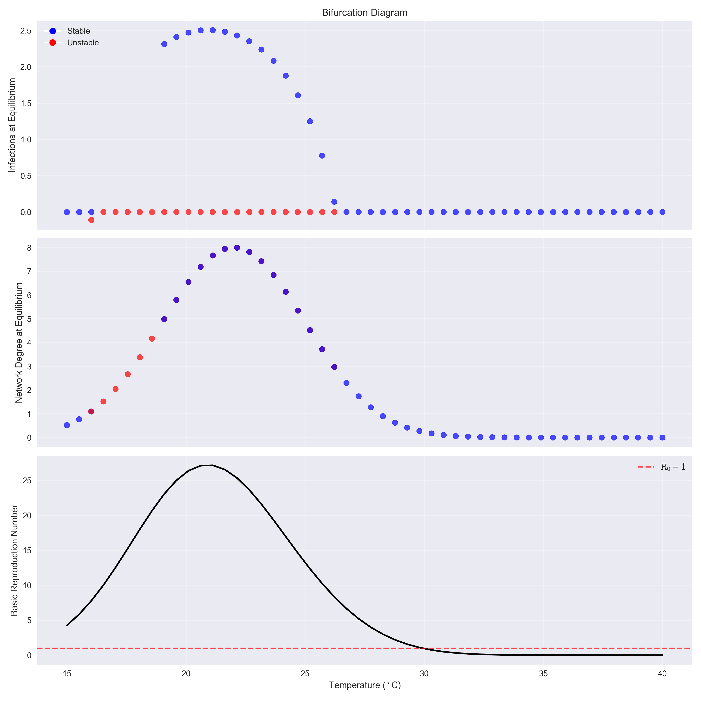

# Urban Climate-Social Network Resilience System

[](https://github.com/skckenneth/urban_climate_resilience/actions/workflows/climate_analysis.yml)
[](https://opensource.org/licenses/MIT)
[](https://www.python.org/downloads/)

A comprehensive mathematical modeling framework for analyzing coupled climate-epidemic-social network dynamics in urban environments. This system provides advanced tools for understanding how climate change impacts disease spread through dynamic social networks and optimal resource allocation strategies.

## 🌟 Key Features

### 🧮 Mathematical Models
- **Climate-Forced SEIR Model**: Epidemiological dynamics with temperature/humidity dependencies
- **Dynamic Network Evolution**: Social connectivity that responds to climate stress
- **Coupled System Dynamics**: Bidirectional feedback between epidemic and network states
- **Optimal Control Theory**: Resource allocation strategies for disease mitigation

### 📊 Advanced Analysis Capabilities
- **Stability Analysis**: Eigenvalue analysis and equilibrium characterization
- **Bifurcation Analysis**: Critical temperature thresholds identification
- **Sensitivity Analysis**: Morris screening and Sobol variance-based methods
- **Control Optimization**: Pontryagin's maximum principle for optimal strategies

### 🚀 Automated Workflows
- **GitHub Actions Integration**: Cloud-based analysis execution
- **Parallel Processing**: Multi-scenario efficient computation
- **Comprehensive Visualization**: Publication-ready figures generation
- **Flexible Configuration**: Quick testing and full research modes

## 📈 Example Results

The system generates comprehensive visualizations across multiple analysis dimensions:

### Epidemic Dynamics Comparison

*Comparison of SEIR dynamics under different climate scenarios*

### Stability and Bifurcation Analysis

*Temperature-driven bifurcation points in system stability*

### Sensitivity Analysis

*Parameter importance ranking using Morris and Sobol methods*

## 🚀 Quick Start

### Installation

```bash
# Clone the repository
git clone https://github.com/skckenneth/urban_climate_resilience.git
cd urban_climate_resilience

# Install dependencies
pip install -r requirements.txt

# Or install as package (recommended)
pip install -e .
```

### Running Your First Analysis

```bash
# Quick test run (90 days, 5000 population)
python main.py --quick-mode

# Run specific climate scenario
python main.py --analysis-type heatwave --quick-mode

# Full research analysis (365 days, comprehensive outputs)
python run_full_analysis.py
```

## 🔬 Analysis Modes

### 1. Quick Mode (Testing & Development)
Perfect for rapid iteration and testing:
- **Duration**: 90 days simulation
- **Population**: 5,000 individuals
- **Runtime**: ~2-5 minutes
- **Outputs**: Basic epidemic curves and summary statistics

```bash
python main.py --quick-mode --analysis-type baseline
```

### 2. Paper Mode (Research & Publication)
Comprehensive analysis for research purposes:
- **Duration**: 365 days simulation
- **Population**: 10,000+ individuals
- **Runtime**: ~30-60 minutes
- **Outputs**: Complete analysis suite with all visualizations

```bash
python run_full_analysis.py
```

## ☁️ GitHub Actions - Cloud Analysis

### Running Analysis in the Cloud

1. **Navigate to Actions Tab**
   - Go to your repository on GitHub
   - Click the "Actions" tab

2. **Select Climate Analysis Workflow**
   - Click on "Climate Analysis" workflow
   - Click "Run workflow" button

3. **Configure Analysis**
   - **Analysis Mode**: 
     - `quick`: Fast testing (5 min runtime)
     - `paper`: Full research analysis (60 min runtime)
   - **Scenario Type**: `baseline`, `heatwave`, or `extreme`

4. **Download Results**
   - After completion, scroll to "Artifacts" section
   - Download `analysis-results-{run-number}.zip`
   - Extract to access all generated figures and data

### Generated Outputs

#### Quick Mode Results
- `{scenario}_epidemic.png` - Epidemic dynamics visualization
- `{scenario}_data.npz` - Simulation data arrays
- `{scenario}_summary.txt` - Key statistics summary

#### Paper Mode Results (Complete Suite)
- **📊 Epidemic Dynamics**: Baseline, heatwave, and extreme scenario comparisons
- **🔍 Stability Analysis**: Eigenvalue analysis and equilibrium characterization
- **📈 Bifurcation Analysis**: Temperature-driven system transitions
- **🎯 Sensitivity Analysis**: Morris screening and Sobol variance decomposition
- **🎮 Control Analysis**: Optimal resource allocation strategies
- **🌐 Phase Portraits**: System state space visualization
- **📝 Comprehensive Reports**: Detailed statistical summaries

## 🏗️ Project Architecture

```
urban_climate_resilience/
├── 📁 models/                    # Core mathematical models
│   ├── coupled_system.py         # Main coupled dynamics implementation
│   ├── epidemiological_model.py  # Climate-forced SEIR model
│   ├── network_model.py          # Dynamic social network evolution
│   └── optimal_control.py        # Control theory implementation
├── 📁 analysis/                  # Advanced analysis modules
│   ├── stability_analysis.py     # Eigenvalue & equilibrium analysis
│   ├── sensitivity_analysis.py   # Morris & Sobol methods
│   └── control_analysis.py       # Optimal control strategies
├── 📁 utils/                     # Utility functions
│   ├── parameters.py             # Model parameter definitions
│   ├── visualization.py          # Publication-quality plotting
│   ├── data_generator.py         # Climate scenario generation
│   └── gallery_generator.py      # Figure gallery creation
├── 📁 .github/workflows/         # CI/CD automation
│   └── climate_analysis.yml      # GitHub Actions workflow
├── main.py                       # Quick analysis entry point
├── run_full_analysis.py          # Comprehensive research analysis
├── parallel_analysis.py          # Multi-scenario parallel processing
└── setup.py                      # Package configuration
```

## 🔧 Configuration

### Model Parameters

Key parameters can be configured in `utils/parameters.py`:

```python
# Population and network parameters
N = 10000              # Total population size
k_mean = 8.0          # Average network connectivity
gamma = 3.0           # Network clustering parameter

# Epidemiological parameters
beta_base = 0.3       # Base transmission rate
alpha = 0.02          # Climate sensitivity parameter
sigma = 1/5.2         # Incubation rate (1/days)
gamma_epi = 1/10      # Recovery rate (1/days)

# Climate scenarios
temp_amplitude = 5.0   # Temperature variation amplitude
humidity_base = 0.6   # Baseline relative humidity
```

### Scenario Types

1. **Baseline**: Normal climate conditions with seasonal variation
2. **Heatwave**: Extended high-temperature periods with reduced humidity
3. **Extreme**: Severe climate conditions with high variability

## 📊 Understanding the Outputs

### Epidemic Dynamics Plots
- **Susceptible (S)**: Population at risk
- **Exposed (E)**: Recently infected, not yet infectious
- **Infected (I)**: Currently infectious individuals
- **Recovered (R)**: Immune or removed from population

### Network Metrics
- **Average Connectivity**: Mean number of social connections
- **Clustering Coefficient**: Local network density measure
- **Rewiring Rate**: Network adaptation speed to climate stress

### Stability Metrics
- **Eigenvalues**: System stability indicators
- **Equilibrium Points**: Long-term system states
- **Bifurcation Points**: Critical parameter thresholds

## 🔬 Research Applications

This framework enables investigation of:

1. **Climate-Health Interactions**: How temperature and humidity affect disease transmission
2. **Social Network Resilience**: Community adaptation to environmental stress
3. **Intervention Strategies**: Optimal timing and allocation of public health resources
4. **Tipping Points**: Critical climate thresholds for epidemic outbreaks
5. **Policy Analysis**: Comparative effectiveness of different intervention approaches

## 📚 Technical Background

### Mathematical Framework

The system implements a coupled differential equation model:

```
dS/dt = -β(T,H) * S * I / N - μS + μN
dE/dt = β(T,H) * S * I / N - σE - μE  
dI/dt = σE - γI - μI
dR/dt = γI - μR

dk/dt = α_k * f(T,H) * (k_target - k)
dC/dt = α_C * g(T,H) * (C_target - C)
```

Where:
- `β(T,H)` is climate-dependent transmission rate
- `k` is average network connectivity  
- `C` is clustering coefficient
- `T,H` are temperature and humidity forcing

### Sensitivity Analysis Methods

1. **Morris Screening**: Efficient identification of influential parameters
2. **Sobol Indices**: Variance-based sensitivity quantification
3. **Parameter Ranking**: Importance hierarchy for model understanding

## 🤝 Contributing

We welcome contributions! Please see our contributing guidelines:

1. Fork the repository
2. Create a feature branch (`git checkout -b feature/amazing-feature`)
3. Commit your changes (`git commit -m 'Add amazing feature'`)
4. Push to the branch (`git push origin feature/amazing-feature`)
5. Open a Pull Request

## 📄 License

This project is licensed under the MIT License - see the [LICENSE](LICENSE) file for details.

## 📖 Citation

If you use this framework in your research, please cite:

```bibtex
@software{cheng2024urban_climate_resilience,
  author = {Cheng, Kenneth Sok Kin},
  title = {Urban Climate-Social Network Resilience System},
  year = {2024},
  publisher = {GitHub},
  url = {https://github.com/skckenneth/urban_climate_resilience}
}
```

## 📞 Contact

**Kenneth Sok Kin Cheng**  
📧 Email: sokkincheng@gmail.com  
🔗 GitHub: [@skckenneth](https://github.com/skckenneth)

---

*Built with ❤️ for climate resilience research*

